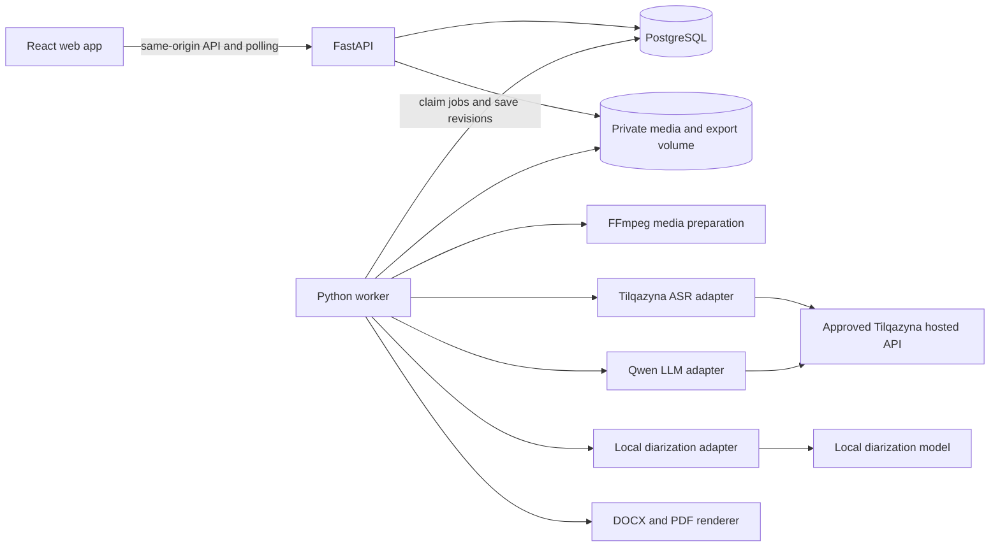

# Meeting minutes assistant implementation plan

Build a working meeting assistant for Samruk-Kazyna: upload or record a meeting, transcribe Russian/Kazakh/mixed speech with the team's Tilqazyna ASR, identify speaker turns, extract evidence-backed assignments and summaries, review them, and export a protocol. Use Python FastAPI, React with TypeScript, PostgreSQL and Docker Compose.

This is a planning deliverable dated 23 September 2026. No application scaffold or provider integration is implemented yet. The requested implementation window is **five hours**, organized into parallel workstreams with integration gates. The full roadmap is described here; completion claims must reflect what passes those gates.

Read [the source review](docs/SOURCE_REVIEW.md) for the complete case inventory, reference assignments and source limitations. Read [AGENTS.md](AGENTS.md) before implementation.

## 1. Decisions and unresolved dependencies

| Item | Decision or current status |
| --- | --- |
| Backend | FastAPI, Pydantic, SQLAlchemy, Alembic; one shared Python package for API and worker |
| Frontend | React, TypeScript, Vite, React Router, TanStack Query; a small consistent component system |
| Persistence | PostgreSQL for records and durable jobs; private filesystem volume for media and exports |
| ASR | Integrate existing `til-asr`; request word timestamps and keep punctuation; do not train or replace it |
| Diarization | Separate local adapter unless the team provides an integrated diarizer; map anonymous speaker IDs to people through review |
| Extraction and summary | Tilqazyna hosted `qwen` for the approved demo; configurable private LLM adapter for later deployment |
| Runtime | Compose with web, API, worker, database and applicable local model services |
| Delivery | Five-hour sprint; hardware provisioned by the team, actual model sizing and throughput measured during integration |
| First usable path | Recorded audio/video upload, with browser recording added on the same ingestion path |
| Platform joining | Full roadmap item; not assumed achievable for three meeting platforms during the first five hours |
| Provider location | **Resolved by user:** organizers explicitly approved the supplied hosted Tilqazyna API for the hackathon demo |

The ASR interface is known from the user-supplied documentation. The exact Qwen chat/structured-output contract and local diarizer setup still need verification. Private ASR/LLM weights, container images and hardware sizing remain requirements for the later on-premise deployment.

The user explicitly confirmed organizer approval for hosted API use on 23 September 2026. Plan the five-hour demo around the supplied Tilqazyna ASR and Qwen endpoint; no further confirmation of that choice is needed. Keep provider adapters configurable for private deployment. Record the hosted exception in the submission: the demonstration is not an offline/on-premise deployment. Use labeled fake fixtures only for deterministic development tests, not as substitutes for working inference.

## 2. Product scope and acceptance mapping

**P0** is the mandatory working workflow. **P1** is the comprehensive five-hour target after the core integrates. **P2** is the subsequent roadmap, with honest status in the demo.

| Capability | Priority | Acceptance evidence |
| --- | --- | --- |
| Audio ingestion and validation | P0 | Supplied MP3s and a fresh recording become durable processing jobs |
| Russian transcription | P0 | Real ASR output, timed words and playable evidence |
| Kazakh transcription | P0 | A Kazakh recording passes the same pipeline |
| Mixed-language transcription | P0 | Switching within and between utterances is preserved |
| Speaker diarization | P0 | Distinct timed speaker turns, editable participant mapping, uncertain overlap flagged |
| Assignment extraction | P0 | Action, person/department, raw deadline and source evidence; unresolved fields remain explicit |
| Meeting summary | P0 | Topics, facts, decisions, risks and open questions grounded in the transcript |
| Human review | P0 | Transcript, speaker, owner, deadline and summary edits persist and appear in export |
| DOCX and PDF export | P0 target | Both formats generated from the same saved revision and visually checked |
| Approved inference boundary and protected data | P0 constraint | Hosted Tilqazyna exception documented; no unrelated audio/text transfer; private deployment remains a separate target |
| Reproducible startup and README | P0 | Clean setup with documented model provisioning, sample workflow and actual checks |
| Video audio extraction | P1 | MP4/WebM audio track processed; silent/unsupported video rejected clearly |
| Browser microphone recording | P1 | Recording notice, capture, stop and upload; no claim of streaming ASR |
| Assignment dashboard | P1 | Filters for owner, deadline and state; unresolved deadlines visible |
| Automatic in-app reminders | P1 | Confirmed dated tasks generate due-soon/overdue notifications without duplicates |
| Russian and Kazakh UI strings | P1 | Core screens localized, source speech preserved verbatim |
| Urgency/topic labels | P1 | Editable suggestions, supported by evidence |
| External email or corporate-message delivery | P2 | Explicit recipient mapping and configured private delivery channel |
| Teams/Zoom/Meet attendance and live transcript | P2 | Platform-specific authentication, consent, media ingestion and reconnection implemented/tested |
| EDMS, SSO, voice enrollment, enterprise deployment | P2 | Separate integration and operational validation |

Both export formats are planned; the case uses “PDF/DOCX” and does not explicitly clarify whether one or both are required. Finishing both is inexpensive relative to the value of a complete protocol workflow.

## 3. Main user journey and screens

1. **Meetings.** List recent meetings with processing/review status, date, participants and unresolved assignment count. Create a meeting or resume one.
2. **New meeting.** Enter title, meeting date/timezone and optional participant roster; upload audio/video or record in browser. Show the recording/transcription notice. Acknowledge whether the source is synthetic/anonymized. If the meeting date is unknown, allow transcription but leave relative dates unresolved.
3. **Processing.** Show actual stage, elapsed time and a useful failure/retry action. Use stage progress or processed-audio duration; never fabricate a percentage from a timer. Refreshing the page preserves the job.
4. **Review workspace.** Audio player above a timed transcript, with summary and assignments in adjacent tabs/panels. Clicking evidence seeks playback and highlights its transcript span. Speaker labels are consistent, keyboard accessible and not distinguished by color alone.
5. **Participants.** Rename/map speakers, add a nonspeaking assignee or department, and mark uncertain speaker attribution. Speaker mapping is manual-confirmed, not biometric identification.
6. **Assignments.** Editable action, assignee, deadline wording/calendar suggestion, status and evidence. Separate “needs clarification” from execution status. Preserve original wording alongside a normalized due date.
7. **Protocol.** Review topics, decisions, risks, assignments and optional transcript appendix. Save a reviewed revision, then download DOCX/PDF. Draft export is allowed only with a clear draft/unresolved label.
8. **Follow-up.** A simple task table and in-app notification list cover approaching/overdue confirmed deadlines. Event-based and missing deadlines stay in the clarification queue.

Default the UI to Russian with Kazakh localization dictionaries. Preserve code-switched text; do not silently translate the transcript. Summary language is selectable (Russian/Kazakh) after validating the LLM's output. Use neutral enterprise styling, readable tables, clear save state and prominent evidence access.

## 4. Architecture



The web container serves the built SPA and proxies `/api` to FastAPI. The browser never receives model credentials or calls model endpoints. FastAPI handles authentication, validation, transactions and downloads; inference and document rendering run in the worker. Heavy computation belongs outside the request process; this follows the [FastAPI background-task guidance](https://fastapi.tiangolo.com/tutorial/background-tasks/).

Keep one backend codebase with modules for meetings, media, participants, transcripts, analysis, assignments, exports and jobs. Do not add Kubernetes, an agent framework, vector search, a message broker or object-storage service during the sprint. These are not needed to process the supplied meetings.

Use a PostgreSQL job table and one worker initially. Atomic job claims can use `FOR UPDATE SKIP LOCKED`, which PostgreSQL documents for queue-like consumers. Claim in a short transaction and release the lock before inference. This is a small scheduling mechanism, not a general workflow engine. [PostgreSQL locking documentation](https://www.postgresql.org/docs/current/sql-select.html)

### Worker behavior

- Insert a job in the same database transaction as its requested operation. Return `202 Accepted` with a job ID.
- Persist `queued`, `running`, `succeeded`, `failed`, `cancel_requested` and `cancelled`, plus current stage, attempt count, heartbeat, lease expiry and a safe error code.
- Claim with a unique lease/attempt token; heartbeat independently while the ASR call or subprocess runs. A new worker can reclaim an expired lease. A worker that lost its lease cannot publish results.
- Process stages sequentially on a shared GPU until memory measurements justify concurrency. Two services residing on the same GPU still consume memory while idle; size or explicitly unload them.
- Retry only transient failures, with bounded backoff and a maximum attempt count. Bad input/auth/configuration errors require correction. Model timeouts may leave remote work running; do not assume retries are free or deduplicated by the provider.
- Write files to unique attempt paths and publish immutable stage artifacts transactionally. An interrupted attempt cannot overwrite another result.
- On retry, reuse successful artifacts only when input hash, model revision and configuration match. Never duplicate the task set on replay.
- Cancellation stops future stages and attempts a bounded termination of owned subprocesses; if an HTTP provider cannot cancel, discard its eventual result. Deletion marks a meeting unavailable immediately and fences all in-flight writes before cleanup.
- Poll job state every two seconds while active, with backoff when the tab is hidden. SSE/WebSockets are optional later.

## 5. Speech processing and model contracts

### ASR adapter

Define `ASRProvider.transcribe(media, options) -> ASRResult`. Implement Tilqazyna with an explicit HTTP client so provider-specific fields are preserved. These are supplied contract details, not live-verified behavior:

```text
POST {ASR_BASE_URL}/audio/transcriptions
Authorization: Bearer ${ASR_API_KEY}
Content-Type: multipart/form-data
file=<audio>
model=til-asr
words=true
punctuate=true

response:
  duration_seconds: number
  text: string
  words: [{ word: string, start: number, end: number }]
```

`ASR_BASE_URL` includes `/v1`. Configure a short connection timeout and initially a 900-second read timeout; keep browser requests short by scheduling the call in the worker. Stream file uploads. Do not log headers, keys or full responses. Redact provider error messages before exposing them.

Documented inputs are WAV, MP3, M4A, OGG and FLAC. Keep local upload size/duration limits despite the provider claiming no limits; proposed first defaults are 250 MiB and 60 minutes, configurable and measured against deployment capacity. Video/browser recordings are converted into an accepted audio format locally. Maintain a full-length time origin when resampling.

The supplied API already chunks long recordings and returns global word timestamps. Do not chunk the short samples again. Validate nonnegative finite word times, `end >= start`, monotonic order within tolerance and bounds against measured duration. Missing word timestamps must produce a visible capability warning or controlled failure, never invented word timing. Preserve original response text and words independently of later human edits.

Error handling: `400` invalid input, `401` credentials/configuration, `429` bounded backoff respecting `Retry-After`, `502`/temporary network failures eligible for bounded retry. No provider speaker IDs, confidence field or streaming endpoint was documented; do not assume them. The documented sandbox is limited to ten requests per minute.

### Media and diarization

Use FFprobe to validate duration/streams and FFmpeg to produce model-compatible audio. Select the first intended audio stream explicitly; MP3 cover art must not be mistaken for video meeting content. Preserve the original and a browser-playable derivative, support HTTP range requests, and keep derived offsets relative to the same original timeline.

Run a local diarizer over the full short recording. If no team component is available, evaluate `pyannote/speaker-diarization-community-1`, whose model card documents local/offline loading and exclusive speaker turns. Its access conditions and model artifacts must be prepared before an offline demo; never use the cloud-only alternative. [Official model card](https://huggingface.co/pyannote/speaker-diarization-community-1)

Align each ASR word with the best-overlapping diarization turn. Group words into readable speaker segments. Preserve overlap/uncertainty where assignment is ambiguous; exclusive turns may simplify display but are not proof that overlap did not occur. Allow manual segment-speaker correction. Speaker IDs are meeting-scoped; do not infer the same identity across recordings.

Names can be suggested from a roster and explicit introductions, with evidence. A diarizer detects voice clusters, not names. Maintain separate speaker, utterance author, task issuer, assignee and supervisor concepts where the data supports them.

### Qwen adapter and extraction

Define `AnalysisProvider.analyze(snapshot, language) -> AnalysisDraft`. Confirm the hosted Qwen endpoint, model identifier, context limit and structured-output behavior at the first gate. The supplied base URL is approved, but the exact chat contract still needs verification; an advertised model alias is not a tested extraction interface. Pin the actual model/revision when available.

1. Build a snapshot of transcript turn IDs, text, speaker mappings, participant roster, meeting date/timezone and requested output language.
2. Treat transcript content as untrusted data. Instructions spoken inside a meeting must not change the extraction prompt, invoke tools, choose destinations or execute code.
3. Request structured JSON for topics, factual summary bullets, decisions, risks, open questions and assignment candidates, with evidence turn IDs for factual claims.
4. Validate using Pydantic. Reject nonexistent evidence IDs and malformed field types. Permit one bounded repair attempt; otherwise return a recoverable analysis failure with the transcript intact.
5. Resolve task candidates across the entire meeting: consolidate recaps, preserve negotiated decisions, distinguish an explicit executor from a supervisor, and keep conditional instructions conditional.
6. Normalize dates deterministically from evidence and meeting context. The LLM proposes raw wording and deadline kind; it does not silently invent a date.
7. Save a draft with field-specific review issues. Make evidence clickable before asking the user to confirm an ambiguous name or deadline.

The supplied meetings are short enough to attempt whole-transcript extraction after checking the actual model context budget. For longer recordings, use overlapping speaker-turn windows, then a consolidation pass over candidates and relevant original evidence. Do not summarize away exact owners/dates before extracting them. Model output limits and retries must be bounded.

## 6. Deadline and responsibility rules

Use a typed deadline object: `kind = date | relative | range | event | unspecified`, `raw_text`, nullable `due_date`, optional date range/event reference, `timezone`, `resolution_status`, and an explanation of the normalization rule. Keep extraction/review status separate from task execution status.

- The meeting's confirmed date and IANA timezone are the anchor. Default the timezone field to `Asia/Almaty` as an editable UI suggestion; never silently substitute the upload date for the meeting date.
- Month/day without a year remains partial until a reviewer confirms the year or an explicit documented rule applies. Do not blindly select the current year, especially around year boundaries.
- “This week”, “next week” and “Friday” produce proposed ranges/dates for review using a documented week convention. A week-long activity need not have an exact point deadline.
- “After the contractor meeting” remains event-based until that event is dated/confirmed. “Not stated” remains null.
- An agreed “15 October” supersedes the rejected two-week proposal. If absolute and relative statements conflict after anchoring, show the conflict rather than silently choosing one.
- A contract clause requiring invoices within five working days is content of the contract task, not the template-update deadline.
- Do not invent people, emails, dates, urgency or numeric confidence. Use `review_issues` and supporting evidence. A person or department may be an assignee without a speaker or application account.
- Approved tasks can still have an explicitly acknowledged unknown deadline. Only approved tasks with confirmed actionable dates are eligible for automatic date reminders.

Keep the one-week training estimate and the one-month completion goal distinguishable. In the sprint, related flat assignments with an optional `parent_action_id` are sufficient; a full project-management dependency graph is unnecessary.

## 7. Data model and revision consistency

Use UUIDs, timezone-aware audit timestamps, typed API schemas and explicit foreign keys. Store machine results as immutable revisions; human changes produce a new version or an auditable correction layer.

| Entity | Essential fields |
| --- | --- |
| User/session | Local identity, password hash or configured trusted authentication, role, session expiry |
| Meeting | Title, meeting date/timezone, language preference, created by, lifecycle state, current revision pointers |
| Media | Meeting, private storage key, SHA-256, detected MIME, size, duration, original/derived type |
| Participant | Meeting, display name, kind `person/department`, role, optional linked user |
| Speaker mapping | Transcript revision, speaker ID, participant ID nullable, confirmation state/version |
| Transcript revision | Media hash, provider/model/config revision, original response reference, ordered segments/words |
| Analysis revision | Transcript revision, speaker-map version, meeting-context version, prompt/model revision, summary and candidate actions |
| Assignment | Stable ID, analysis revision, text, assignee, optional supervisor, deadline, condition, review state, execution state, evidence |
| Protocol revision | Immutable reviewed snapshot of summary, participants, assignments, transcript references and unresolved notes |
| Job | Operation, meeting, input revision/hash, state, stage, attempt token/count, lease, heartbeat, safe error |
| Export | Protocol revision, format, state, private file key, checksum, renderer/template version |
| Audit event | Actor, object, operation, old/new revision references, timestamp; no credentials or full transcript logs |
| Notification | P1 recipient/user, assignment revision, kind, scheduled date, read/delivery state, deduplication key |

Word arrays and immutable analysis payloads may use JSONB initially; assignments and queryable ownership/deadline fields should remain relational. Do not create one SQL row per word without a demonstrated need.

**Consistency rules:**

1. Every generated result records exactly which transcript, participant mapping and meeting context it used.
2. Transcript, speaker mapping or meeting-date edits mark dependent analysis stale. The UI shows this immediately and offers regeneration or explicit review of the affected fields.
3. A stale worker may save a historical attempt but cannot replace the current reviewed result. Publish using an expected-revision and lease-token check.
4. Use optimistic concurrency (`version`/`If-Match`); stale writes return `409 Conflict` with reload guidance. Do not silently overwrite another edit.
5. Text corrections retain original timed-word evidence. If a changed passage no longer has exact word alignment, display segment-level timing until realignment; never imply word precision was recalculated automatically.
6. A saved protocol revision is immutable. Export reads that snapshot, not independently queried mutable tables, so DOCX and PDF agree even if a later edit occurs.

## 8. API contract outline

All application routes live under `/api/v1`. Freeze Pydantic schemas early and generate TypeScript types from OpenAPI. Use one error envelope: `{code, message, details, request_id}` with no sensitive provider payloads. Paginate lists and return ISO dates/timestamps with explicit semantics.

| Method and route | Purpose |
| --- | --- |
| `POST /auth/login`, `POST /auth/logout`, `GET /auth/me` | Local session and current user |
| `POST /meetings`, `GET /meetings`, `GET /meetings/{id}` | Create/list/open meetings |
| `PATCH /meetings/{id}`, `DELETE /meetings/{id}` | Update context with version check; cancel/fence jobs and delete private artifacts |
| `POST /meetings/{id}/media` | Stream multipart upload; validate and attach immutable media |
| `GET /meetings/{id}/media/{media_id}/playback` | Authorized playable media with range support |
| `POST /meetings/{id}/process` | Enqueue pipeline; idempotency key and source revision; return job ID |
| `GET /jobs/{id}`, `POST /jobs/{id}/retry`, `POST /jobs/{id}/cancel` | Persistent stage status, bounded retry and cancellation |
| `GET /meetings/{id}/transcript`, `PATCH /meetings/{id}/transcript` | Read/current revision and save validated segment edits |
| `GET /meetings/{id}/participants`, `PUT /meetings/{id}/participants` | Participants and departments with optimistic concurrency |
| `PATCH /meetings/{id}/speaker-mappings` | Map speaker IDs and flag related analysis stale |
| `POST /meetings/{id}/analyze`, `GET /meetings/{id}/analysis` | Generate/read analysis for an explicit source snapshot |
| `PATCH /meetings/{id}/summary` | Save reviewed summary corrections with evidence and version |
| `GET /meetings/{id}/assignments`, `POST /meetings/{id}/assignments` | List or manually add a labeled assignment |
| `PATCH /assignments/{id}`, `DELETE /assignments/{id}` | Correct/reject/confirm/status-update an assignment with history |
| `POST /meetings/{id}/protocol-revisions` | Freeze a draft/reviewed protocol snapshot |
| `POST /meetings/{id}/exports` | Enqueue DOCX/PDF render for a protocol revision; return job/export ID |
| `GET /exports/{id}`, `GET /exports/{id}/download` | Render status and authorized download |
| `GET /assignments`, `GET /notifications`, `PATCH /notifications/{id}` | P1 dashboard and read state |
| `GET /health/live`, `GET /health/ready` | Process liveness and dependency/capability readiness |

P0 uses a single organizational workspace with simple authenticated editor/viewer roles; verify access on media, jobs and export routes as well as meeting routes. Participants are not automatically app users. P1 reminder recipients require explicit mapping to a user or designated curator. Multi-tenant enterprise permissions and SSO are P2.

## 9. Export design

Render a protocol containing organization/title, confirmed meeting date, participants, topic summary, decisions, assignment table (`number / action / owner / deadline / status`) and open questions. Offer an optional transcript appendix with speaker labels and time references. Keep unknown dates and unresolved responsibility visible.

Use `python-docx` for DOCX and a local headless LibreOffice conversion for PDF from the same DOCX. Run conversion in an isolated per-job temporary profile with resource/time limits. Package fonts with Cyrillic and Kazakh coverage; test `Ә Ғ Қ Ң Ө Ұ Ү Һ І` and lowercase forms. No external font or document conversion service.

DOCX generation is the first export checkpoint; add and visually check PDF before the final gate. Verify readable long tasks, repeated table headers, page breaks, font coverage and no clipping. Check both draft and reviewed documents. Word exports remain editable; the authoritative application state is the saved protocol revision.

## 10. Docker Compose and local operations

Planned topology:

| Service | Responsibility | Persistent access |
| --- | --- | --- |
| `web` | Static React app and reverse proxy | None |
| `api` | FastAPI HTTP/auth/storage endpoints | PostgreSQL; scoped media volume |
| `worker` | Jobs, FFmpeg, local diarization, analysis orchestration, export | PostgreSQL; media/export volume; diarizer model cache |
| `db` | PostgreSQL | Database volume |
| `migrate` | One-shot Alembic migration before API/worker startup | PostgreSQL |
| `asr` | Optional team-provided private model server | Read-only model weights; GPU if required |
| `llm` | Optional private inference server | Read-only model weights; GPU if required |

Provider containers are conditional on actually receiving their images/weights; do not invent working images or Dockerfiles for unavailable proprietary models. A reachable customer-internal inference host is also valid within the approved boundary. Keep private endpoint configuration separate from the application image.

Use explicit health checks and dependency conditions; container creation order alone does not prove readiness. Let `migrate` complete successfully before starting database consumers. [Compose startup-order documentation](https://docs.docker.com/compose/how-tos/startup-order/)

Provide an approved-hosted demo configuration, a local development override and a separate private-model profile. Add a Linux GPU overlay for the local diarizer/private models as needed. GPU reservations must match the target host/runtime; do not assume a developer Mac uses the same NVIDIA path. The team will supply hardware; profile VRAM/RAM before selecting concurrent residency. [Compose GPU documentation](https://docs.docker.com/compose/how-tos/gpu-support/)

Planned configuration names, with placeholders only:

```dotenv
APP_ENV=development
APP_DEFAULT_TIMEZONE=Asia/Almaty
INFERENCE_MODE=approved_hosted
ASR_BASE_URL=https://router.tilqazyna.kz/v1
ASR_MODEL=til-asr
ASR_API_KEY=
ASR_READ_TIMEOUT_SECONDS=900
LLM_BASE_URL=https://router.tilqazyna.kz/v1
LLM_MODEL=qwen
LLM_API_KEY=
DIARIZATION_MODEL_PATH=/models/diarization
MEDIA_ROOT=/data/media
EXPORT_ROOT=/data/exports
MAX_UPLOAD_MIB=250
MAX_AUDIO_MINUTES=60
WORKER_CONCURRENCY=1
```

The hosted base URL/model names come from the supplied integration document. Verify the Qwen route and request shape during implementation. The private profile overrides these with customer-internal addresses. Additional database/session secrets come from ignored environment files or mounted secret files. Never put model secrets in frontend `VITE_*` variables. The runtime must reject absent required model configuration clearly rather than silently selecting a different provider.

Operations and privacy requirements:

- Expose only the web entry point. Bind local demos to loopback; use TLS and authentication for shared network access. Keep database/model ports private.
- Restrict demo inference traffic to the approved provider and required local services. For the private profile, enforce the network boundary at the host/container layer: private DNS or application allowlists alone do not prove no egress. Test after required artifacts are provisioned.
- For the private profile and local diarizer, separate provisioning from runtime: obtain model licenses/access, pin artifacts/checksums and cache weights/container images before an offline test. Disable outbound telemetry and remote error collection containing content.
- Preserve case inputs; do not stage raw recordings or generated transcripts for public publication automatically. Exclude media, models, secrets, caches and exports from build contexts and normal Git additions.
- Stream and bound uploads; inspect actual media, reject unsafe paths, invoke FFmpeg/LibreOffice without shell interpolation, and time-limit subprocesses. User content is never executable.
- Store opaque file IDs, not arbitrary client paths. Scope all downloads and deletes to the meeting. Cleanup original, derivative, provider response and export artifacts according to explicit deletion/retention policy.
- Log request/job IDs, model revision, stage timings, byte counts and safe errors. Avoid full transcript, prompt, raw model output and authorization data in ordinary logs.
- Persist state across `docker compose down`/restart without deleting volumes. Document backup/restore of database and media as a matched set; do not present Compose as a production HA platform.

Expected commands to implement and verify later (not currently available): `make dev`, `make up`, `make migrate`, `make lint`, `make test`, `make e2e`, `make evaluate`, `make demo`, `make down`. `make down` must preserve data; any destructive reset is a distinct explicit operation.

## 11. Proposed repository layout

```text
AGENTS.md
PLAN.md
README.md
compose.yaml
compose.dev.yaml
compose.gpu.yaml                 # only if needed for the chosen private runtime
.env.example
.gitignore
.dockerignore
Makefile
backend/
  pyproject.toml
  uv.lock
  Dockerfile
  alembic.ini
  migrations/
  app/
    main.py
    config.py
    db.py
    api/
    schemas/
    models/
    services/
    providers/                  # ASR, diarization, LLM, explicit fake adapters
    pipeline/                   # media, alignment, extraction, dates
    jobs/                       # worker, claims, leases, retries
    exports/
  tests/
frontend/
  package.json
  pnpm-lock.yaml
  Dockerfile
  src/
    app/
    pages/
    features/                   # meetings, review, assignments, notifications
    components/
    api/                        # generated OpenAPI types and client
    locales/
  tests/
  e2e/
contracts/
  openapi.json
  examples/                     # synthetic API examples only
evaluation/
  fixtures/                     # authorized/anonymized inputs separate from gold labels
  scripts/
  reports/                      # aggregate metrics, no secret/private content
infra/
  nginx.conf
scripts/
docs/
  SOURCE_REVIEW.md
  RUNBOOK.md                    # created during implementation
  MODEL_SETUP.md                # exact image, weights, license, hardware and checksums
  DEMO.md
case files/                     # supplied inputs; preserve originals
```

Pin compatible versions at initialization and commit lockfiles. Keep API and worker dependencies consistent; model servers may use their own environments. React's documentation supports Vite as an app-from-scratch build tool; the SPA is a deliberate choice for this private authenticated workflow. [React guidance](https://react.dev/learn/build-a-react-app-from-scratch)

## 12. Five-hour execution plan

Time is elapsed implementation time from kickoff, not from this planning session. The target uses the approved hosted ASR/Qwen API and assumes local diarizer provisioning and multiple concurrent workstreams. Do not promise that platform approval, unavailable weights or model downloads will fit the same window.

### Workstream ownership

Use one integration lead plus three parallel agents/contributors. Assign roles without guessing which human team member owns them. Publish shared schemas first; only the lead changes root orchestration/contracts unless ownership is handed over.

| Stream | Owned areas | Main deliverable |
| --- | --- | --- |
| Lead / integration | Root config, Compose, API contract, shared schema decisions, final integration | A reproducible running stack and passing demo |
| Backend | `backend/app/api`, models, persistence, jobs, auth, migrations | Durable meeting workflow, review and safe exports API |
| AI pipeline | Providers, audio/alignment/extraction/date modules, evaluation | Real ASR + local diarization + grounded structured analysis |
| Frontend / protocol | React workspace, localized UI; isolated export-template module by agreement | Usable review/dashboard and matching DOCX/PDF output |

Coordinate shared schema changes through the lead; no two streams independently invent field names. The lead can implement export rendering while frontend finishes review. Shared-file edits are serialized even when work is parallel.

### Milestones and gates

| Elapsed time | Backend and infrastructure | AI pipeline | Frontend and exports | Exit gate |
| --- | --- | --- | --- | --- |
| 00:00–00:20 | Scaffold, contracts, PostgreSQL/migrations, secret placeholders, Compose skeleton | Verify approved ASR contract, Qwen JSON response, diarizer access and start model download | Screen shell and synthetic typed examples | **G0:** dependency risks visible; shared contracts fixed; model provisioning started |
| 00:20–01:15 | Auth, meeting/media CRUD, job claim/status, private files | Real audio → ASR words → local speaker turns → aligned transcript | Upload, meetings list, progress, audio/transcript viewer | **G1:** one real recording reaches a timed transcript in the UI |
| 01:15–02:15 | Revision model, participant mapping, analysis/task persistence | Evidence JSON, owner/deadline rules, recap consolidation, schema validation | Participants, task table, summary, evidence seeking | **G2:** one meeting produces reviewable assignments and summary end to end |
| 02:15–03:15 | Optimistic edits, stale-result fencing, protocol snapshot and exports routes | Russian fixture audit plus new Kazakh and mixed recording runs | Saved review, DOCX/PDF renderer and preview checks, browser recording/video handling | **G3:** edits survive reload; both export formats agree with saved review |
| 03:15–04:00 | Dashboard queries, in-app reminder scheduler, cancellation/retry cleanup | Fix largest quality errors; capture timings and failure behavior | Dashboard, notifications, RU/KK strings, empty/error states | **G4:** comprehensive application flow including follow-up works |
| 04:00–04:40 | Clean-start/restart/approved-egress checks, targeted reliability tests | Held-out recording, benchmark report with limitations | E2E review/export, layout and font checks | **G5:** required workflow verified on the target machine |
| 04:40–05:00 | Freeze features; finish README/model runbook and final checks | Record model/config versions and measured results | Rehearse demo and prepare fallback screenshots/artifacts clearly labeled | **G6:** reproducible submission, honest capability checklist, known issues |

### Decision points when a gate slips

- At 00:20, if the approved provider or local diarizer is unavailable, continue contract/UI development with a visible fake provider while resolving the integration dependency. A fake result does not pass G1 or the case's AI requirements.
- At 01:15, prioritize the real speech path over dashboard polish. Manual speaker naming complements diarization; it cannot replace diarization entirely.
- At 02:15, if extraction is unreliable, narrow model prompts, validate evidence and show review issues. Never prefill sample answers to make the demo appear correct.
- At 03:15, preserve multilingual transcription, assignments, diarization, review and at least a working export path. Finish both formats as planned; record any missed target explicitly. P1 improvements can move to the next iteration.
- At 04:00, stop starting optional integrations. Use the last hour for a clean run, verification, documentation and fixes.

## 13. Validation and measurable quality

The source brief specifies no numeric accuracy or latency thresholds. The following are proposed engineering targets, not established results or organizer requirements.

| Area | Test and proposed gate |
| --- | --- |
| ASR contract | Fixture tests for absent words, malformed timing, empty speech, punctuation and error mapping; real provider smoke test separately |
| Language coverage | One real RU, KK and mixed-language recording completes the full pipeline; add one unseen recording |
| ASR quality | Hand-check verbatim excerpts; report WER/CER separately by language only when gold transcription exists; record normalization policy |
| Diarization | Annotate a small real excerpt; report speaker attribution errors or DER with declared scoring settings; map anonymous labels before scoring |
| Extraction | On adjudicated dialogue fixtures, target at least 90% semantic task precision/recall; report owner and deadline-field accuracy separately |
| Grounding | 100% of generated assignments have valid evidence references; manually audit whether evidence actually supports fields |
| Missing facts | Zero invented owners/dates on the explicit unknown/ambiguous fixtures; uncertainty stays visible |
| Source edge cases | Regression tests for all cases in `docs/SOURCE_REVIEW.md`, especially Ерлан, department ownership, negotiated dates and five-day contract clause |
| Reliability | Restart a worker mid-job, retry a transient failure, reject stale edits/results, cancel then delete; no duplicate published task set or late resurrection |
| Persistence | Review corrections and downloaded protocol content agree after browser/API restart |
| Exports | DOCX/PDF on a long-task fixture; verify Kazakh/Cyrillic characters, pagination, wrapping and unresolved notes |
| Privacy | Backend-only secrets, scoped downloads, no content in normal logs, real pipeline uses only the approved hosted provider and local services; private profile gets a separate no-public-egress check |
| Reproducibility | Clean machine/setup instructions plus model bundle produce a working stack and one documented sample run |
| Speed | Measure per-stage and total time, peak RAM/VRAM, and real-time factor; target total processing below recording length after warm-up, subject to actual hardware |

Use pytest for deterministic backend/provider/job tests, React Testing Library/Vitest for substantive review state behavior, and Playwright for the upload → review → correction → export journey. Fake providers are for deterministic tests; run real-model evaluation separately and label its outputs. Avoid brittle exact-summary string comparisons.

The two provided protocols contain 10 and 6 reference task rows, but neither is a perfect timestamped transcript or exhaustive gold set. Never feed their answer tables or summary sections into an extraction evaluation. Record reviewed gold labels and tune prompts on a different split from held-out recordings.

## 14. Follow-up features and growth

The P1 notification scheduler checks approved, confirmed calendar deadlines on a configurable interval. Store a unique key over assignment/version, recipient, notification kind and deadline to prevent repeated alerts. Date-only tasks become overdue after the meeting timezone's end of day; completed/cancelled tasks suppress pending reminders. Updating a deadline invalidates old pending reminders. Event-based/unknown dates require clarification instead of guessed alerts.

Use in-app delivery first. Department assignees need an explicit curator before routing. External message delivery requires configured authorized recipients and a private delivery integration; never scrape or invent contact details.

For P2, introduce meeting-platform adapters one platform at a time. Each needs application permissions, recording notices, bot admission/media access, reconnect behavior and an approved data path. Browser microphone recording is a completed-file ingestion feature; it is not a Teams/Zoom/Meet bot and not streaming ASR. Streaming additionally needs partial/final segments, stable word offsets, speaker-label revisions, backpressure and a streaming-capable model interface.

After the sprint, add corporate SSO and richer permissions, retention/backup administration, EDMS adapters, authorized voice enrollment, task dependencies, delivery integrations and scaling based on measured load. Migrate storage to private object storage or jobs to a broker only when operational needs justify it.

## 15. Submission and demonstration

README should explain the problem, actual implemented scope, architecture, prerequisites, exact versions/model setup, environment placeholders, startup commands, sample workflow, tests/evaluation, privacy boundary and known limitations. The runbook must distinguish a functioning private deployment from a fake development profile or explicitly approved hosted exception.

Suggested demonstration: create a meeting with confirmed date, upload a recording, show real processing, map speakers, inspect an assignment's audio evidence, correct one owner/deadline, save review, download DOCX/PDF, then show the follow-up table and one in-app reminder using a clearly labeled demo clock. Include a short Kazakh/mixed-language recording and distinguish cached artifacts from a live inference run.

Definition of done:

- [ ] G0–G6 outcomes and remaining limitations recorded honestly.
- [ ] Mandatory RU/KK/mixed speech, diarization, assignments, summary and protocol export demonstrated.
- [ ] Organizer-approved hosted exception recorded and deployment claims match reality.
- [ ] Review, evidence and revision consistency work on persisted data.
- [ ] Both supplied recordings exercised locally if their use is permitted; no unsupported accuracy claims.
- [ ] New multilingual and held-out recordings evaluated without reference-answer leakage.
- [ ] DOCX/PDF and language glyphs visually verified.
- [ ] Secret-free repository, documented model provisioning and clean Compose startup checked.
- [ ] README, runbook, measured results and demo script complete.
