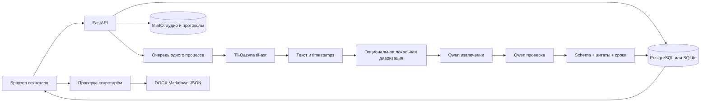

# Архитектура Qorytyn

## Цель

Минимизировать ручную подготовку протокола и сохранить проверяемую связь поручений с речью. Секретарь утверждает результат; модель не принимает управленческие решения и не отправляет поручения людям самостоятельно.

## Поток данных

Провайдеры получают только необходимые входные данные. Анализ текста использует тот же адрес self-hosted сервиса. Pyannote получает локальный путь. Эталонные протоколы находятся вне runtime pipeline.

## Модули

| Модуль | Ответственность |
| --- | --- |
| `backend/app/main.py` | API, загрузка, проверка прав, жизненный цикл и очередь |
| `backend/app/rbac.py` | Роли, права и права на конкретное совещание |
| `backend/app/security.py` | Хеширование паролей scrypt, токены сессий |
| `backend/app/blobs.py` | Записи и файлы протоколов: MinIO / S3 или локальный каталог |
| `backend/app/config.py` | Конфигурация окружения |
| `backend/app/models.py` | Валидируемые структуры данных |
| `backend/app/store.py` | SQLAlchemy: совещания, пользователи, сессии, журнал; версии документов |
| `backend/app/pipeline.py` | ASR, сегментация, адаптер диаризации, извлечение и проверка |
| `backend/app/deadlines.py` | Консервативное разрешение дат относительно даты встречи |
| `backend/app/exports.py` | Экспорт протокола в DOCX, Markdown и PDF |
| `backend/app/static/` | Интерфейс без внешних JS/CDN зависимостей |
| `backend/scripts/smoke.py` | Воспроизводимая проверка реального сервиса |

## Состояния и сбои

`queued → transcribing → diarizing → analyzing → ready → approved`; ошибка любого этапа обработки переводит встречу в `failed`. Утверждённый протокол (`approved`) можно вернуть в `ready`. Транскрипт сохраняется до обращения к LLM, поэтому ошибка анализа не уничтожает распознанный текст. Ручной повтор сейчас запускает весь конвейер, в том числе ASR. Автоматических повторов запросов нет, чтобы не создавать неограниченную нагрузку.

Веб-очередь ограничена пятью активными/ожидающими заданиями, одновременно выполняется одно. Это MVP, а не распределённая очередь. SQLite включён в WAL; каждое соединение закрывается. Изменение документа выполняется условным `UPDATE ... WHERE version = ?`, чтобы устаревший редактор не перезаписал новые правки. При запуске приложения незавершённые записи отмечаются прерванными. Несколько процессов на одной базе не поддерживаются.

## Доступ

Глобальные права задаются ролью: управление пользователями, журнал, создание совещаний. Доступ к конкретному совещанию вычисляет `meeting_permissions` по роли и связи пользователя с совещанием: создатель, председатель, участник или исполнитель поручения. Пользователь без права просмотра получает 404, а не 403, чтобы не раскрывать существование совещания. Администратор и аудитор видят только метаданные: разделение обязанностей по управлению системой и чтению протоколов.

## Проверяемость вывода

LLM возвращает структуру `Analysis` с саммари, решениями, поручениями и предупреждениями. Два прохода: извлечение, затем проверка пропусков и исполнителей. Это фиксированный конвейер с проверкой, а не автономный агент с доступом к внешним действиям.

Программная проверка отвергает поручения без непрерывной цитаты из транскрипта, сопоставляя регистр и пробелы. Сегменты источника пересчитываются по позиции цитаты; модель не может назначить выдуманный ID. Точные дубликаты удаляются. Нечёткая семантическая дедупликация не реализована. Все поручения сначала имеют `needs_review=true`.

Числовые даты, часть русских словесных дат и некоторые относительные сроки разрешаются кодом. Неоднозначные интервалы сохраняются текстом без конечной даты. Казахские `бүгін` / `ертең` поддержаны, полный морфологический парсер казахских сроков отсутствует. Недостающие ФИО нельзя восстановить надёжно без списка участников и контекста: поле остаётся предметом ручной проверки.

Точная цитата не гарантирует верного исполнителя, а второй проход LLM не является независимым доказательством. ASR может исказить сам источник. Поэтому интерфейс позволяет прослушивание и требует проверки человеком.

## Развёртывание и развитие

Для production: отдельный worker и долговечная очередь, нормализованные поручения и история текста в PostgreSQL, миграции Alembic, SSO, защищённое хранилище с retention, локальные версии моделей с фиксацией хешей, мониторинг латентности и качества. Отправку уведомлений строить через transactional outbox с дедупликацией и разрешением человека, затем подключать адаптер СЭД.

Первый следующий приоритет — закончить локальную диаризацию и привязку голосов к участникам, затем добавить референсный RU/KZ/MIX набор с размеченными поручениями и speaker turns. После этого измерять WER, DER, точность ответственных, precision/recall поручений и долю сроков без ручного исправления.
